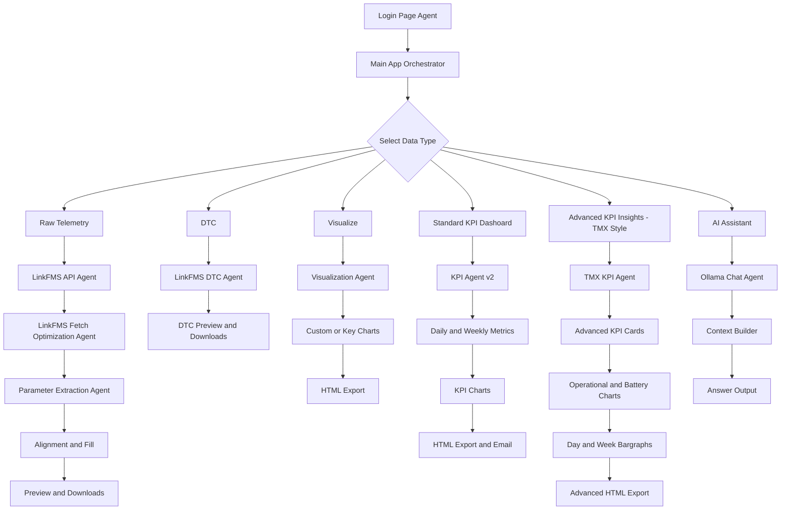

```mermaid
flowchart TD
    A[Login Page Agent] --> B[Main App Orchestrator]
    B --> C{Select Data Type}

    C --> D[Raw Telemetry]
    C --> E[DTC]
    C --> F[Visualize]
    C --> G[Standard KPI Dashoard]
    C --> H[Advanced KPI Insights - TMX Style]
    C --> I[AI Assistant]

    D --> D1[LinkFMS API Agent]
    D1 --> D2[LinkFMS Fetch Optimization Agent]
    D2 --> D3[Parameter Extraction Agent]
    D3 --> D4[Alignment and Fill]
    D4 --> D5[Preview and Downloads]

    E --> E1[LinkFMS DTC Agent]
    E1 --> E2[DTC Preview and Downloads]

    F --> F1[Visualization Agent]
    F1 --> F2[Custom or Key Charts]
    F2 --> F3[HTML Export]

    G --> G1[KPI Agent v2]
    G1 --> G2[Daily and Weekly Metrics]
    G2 --> G3[KPI Charts]
    G3 --> G4[HTML Export and Email]

    H --> H1[TMX KPI Agent]
    H1 --> H2[Advanced KPI Cards]
    H2 --> H3[Operational and Battery Charts]
    H3 --> H4[Day and Week Bargraphs]
    H4 --> H5[Advanced HTML Export]

    I --> I1[Ollama Chat Agent]
    I1 --> I2[Context Builder]
    I2 --> I3[Answer Output]
```